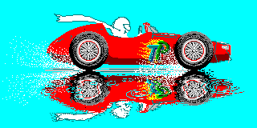
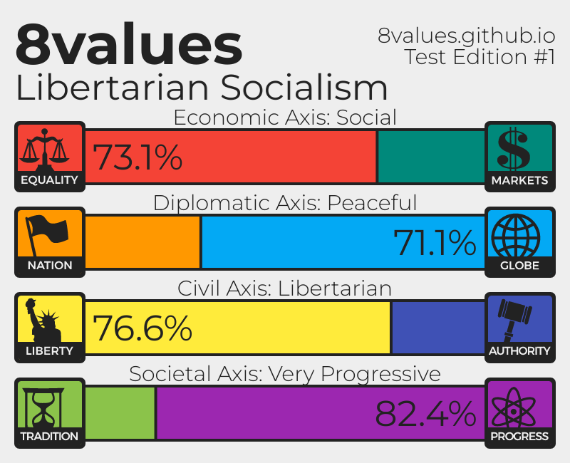
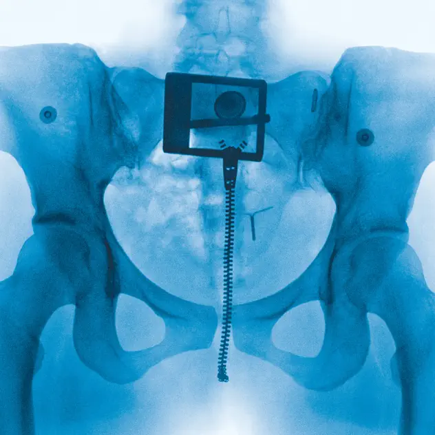

Image format support on GitHub
==============================

AI
-------------------------

APNG
-------------------------
### `.apng`

### `.png`

AVIF
-------------------------

BMP
-------------------------

GIF
-------------------------

HEIC
-------------------------

ICNS
-------------------------

ICO
-------------------------
### `.ico`

### `.cur`

JPEG
-------------------------

JPG
-------------------------

PNG
-------------------------

PSD
-------------------------

TIF
-------------------------

TIFF
-------------------------

WEBP
-------------------------

XBM
-------------------------

