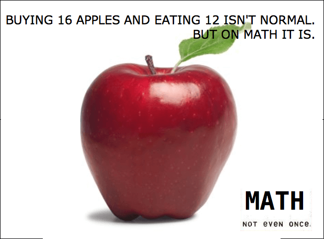

   Math: One not even

Inline
------
Before $\sqrt{3x-1}+(1+x)^2$ After

This expression uses `\$` to display a dollar sign: $\sqrt{\$4}$

Block
-----
$$\sqrt{3x-1}+(1+x)^2$$

.. role:: html(raw)
   :format: html

.. |$| replace:: :html:`$`

To split |$|\ 100 in half, we calculate $100/2$